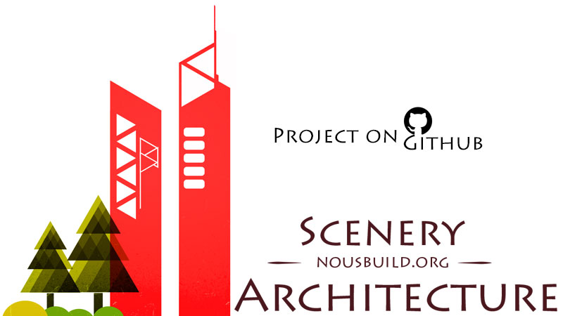

# About

### Project of [Scenery Architecture](http://www.nousbuild.org)

Project now it's on Github :-)

### What is Scenery Architecture

Scenery Architecture is a unique style website that combines computer programming and program development, architectural design, structural design, and graphic and UI design. 

It includes: **I'm**, **Code Lab**, **Code Studio**, **Showroom**, **Creative Cottage**, **Newsstand**, and **Design Factory**, a total of 7 sub-brands. Now is the era of the Internet. With the help of the Internet, we have made new breakthroughs in the various professions.

### Members

[windmill0503](https://github.com/windmill0503) , [bitcookies](https://github.com/bitcookies)

